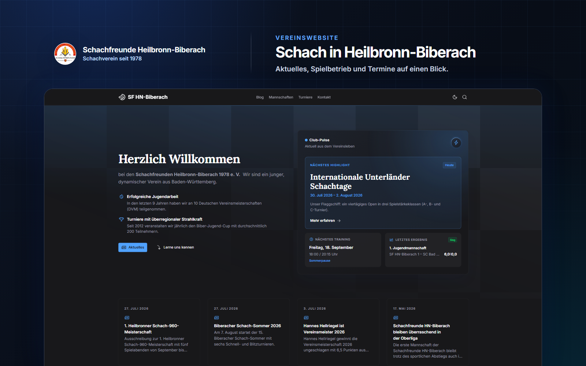

# Schachfreunde Heilbronn-Biberach

[](https://github.com/sfbiberach/schachfreunde-biberach.de/actions/workflows/ci.yml)
[](https://nuxt.com)
[](https://ui.nuxt.com)

The official website of **Schachfreunde Heilbronn-Biberach 1978 e. V.**, featuring club news, teams, and tournaments.

[Visit the website](https://www.schachfreunde-biberach.de)



## About

The website brings the club's activities together in a modern, responsive Nuxt application that is easy to maintain:

- news and articles powered by Nuxt Content
- teams, line-ups, and results imported from nuLiga
- tournament, event, and club information
- full-text search, an RSS feed, and PWA support
- automatically generated Open Graph and social images

The project is built with [Nuxt 4](https://nuxt.com), [Nuxt UI](https://ui.nuxt.com), [Nuxt Content](https://content.nuxt.com), and [Nuxt Studio](https://nuxt.studio). Production runs on Cloudflare Workers.

## Local development

Node.js 22 and pnpm 11 are required.

```bash
pnpm install
cp .env.example .env
pnpm dev
```

The application is then available at `http://localhost:3000`. Nuxt Studio credentials in `.env` are optional for regular local development.

## Commands

| Command | Purpose |
| --- | --- |
| `pnpm dev` | Start the development server |
| `pnpm verify` | Run linting, content validation, type checks, and tests |
| `pnpm build` | Create and validate the Cloudflare production build |
| `pnpm generate` | Create and validate the static output |
| `pnpm media:readme` | Render the current website preview for this README |
| `pnpm media:social -- --path <route> --format all` | Export social images for a route |

## Updating media

The preview at the top of this README is rendered from the locally running website:

```bash
pnpm media:readme
```

Chromium must be installed once before the first README export:

```bash
pnpm exec playwright install chromium
```

Nuxt automatically generates 1200 × 630 Open Graph images for relevant pages. The same designs can also be exported as social media assets:

```bash
pnpm media:social -- --path /blog/article/15-biber-jugend-cup --format all
```

Supported formats are `og`, `square`, `portrait`, and `all`. Local exports are written to the git-ignored `.artifacts/social` directory.

## Editorial workflow with Codex

The optional `schachfreunde-blog` Codex plugin creates and revises publication-ready blog posts from text, notes, images, and attachments.

[Open the plugin documentation](plugins/schachfreunde-blog/README.md)

## Deployment

The production build uses Nitro's `cloudflare-module` preset. Wrangler connects two persistent resources to the Worker:

- `DB`: D1 runtime index for Nuxt Content
- `NULIGA_CACHE`: KV cache for nuLiga data and dynamically rendered Open Graph images

Content remains version-controlled in the repository. Missing Cloudflare resources are provisioned during the first deployment through the generated Wrangler configuration.
